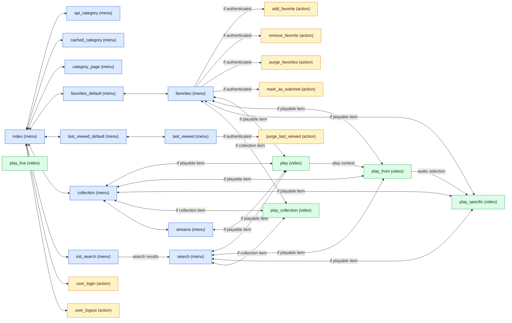
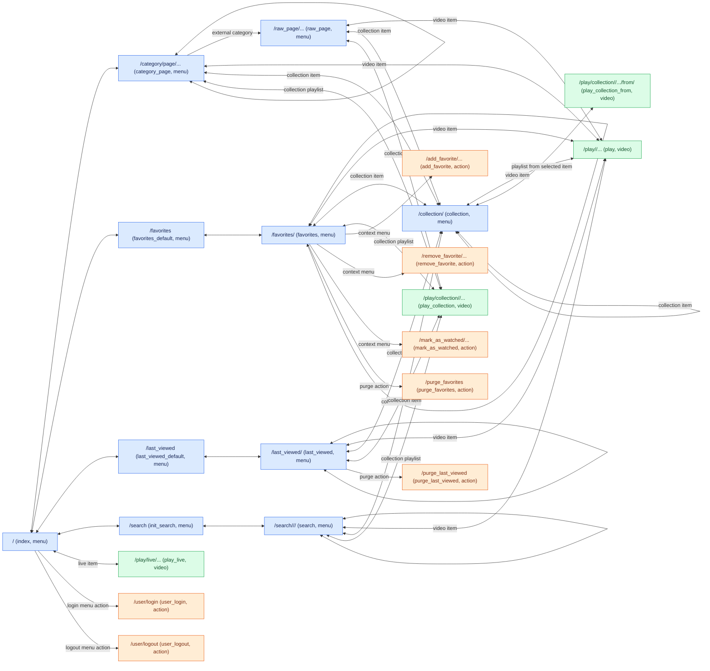

# Arte +7

<p align="center">
  
</p>

## Description

Plugin "plugin.video.arteplussept" to browse Arte content and watch it in multiple languages and subtitles on Kodi (ex XBMC).
Can be used without or with Arte account in order to benefit from a better cross-device experience. For instance starting a video or a serie on the mobile app and resume it on kodi or to share same favorites.

### Features

- Browse and watch Arte replays
- Watch Arte live stream
- Watch Arte content in multiple languages and subtibles
- Search for content on Arte
- Browse or search multi-page content
- Play serie as a playlist or browse serie as a menu.
- Resume a serie from the first not completed episode thanks to Arte history (login required)
- Load serie as a playlist, when watching one of its episode
- Login with your Arte account without storing password on filesystem - only the token 
- Login with basic (user password) or device flow authentication method
- Manage - view or purge - your Arte history (login required)
- Manage - view, add, delete or purge - your Arte favorites (login required)
- Supported language : DE, EN, FR, IT, PL, RO

### Not (very well) supported
- Resume videos from where you stopped them (cross device) (login required)
- Geo blocking
- Display of availability / broadcasting dates

For feature requests or reporting issues go [here](https://github.com/thomas-ernest/plugin.video.arteplussept/issues).

# Donation

The extension is free. Nevertheless, any donation will motivate me to maintain it.
Various donation methods are listed at https://thomas-ernest.github.io/

# Contributing

Contributions are welcome !
You may look at the [issues](https://github.com/thomas-ernest/plugin.video.arteplussept/issues) or unsupported features above.

## Install the addon locally

Follow the steps bellow depending on your system and software version

### 1. Open the addons folder

Kodi is installed on a different path according to the operating system it is installed on. You can refer to [this page](https://kodi.wiki/view/Kodi_data_folder). Go to $KODI_FOLDER/addons/

### 2. Dowload the addon

In Kodi addons folder
- clone this repository or one of if its forks (preferred) and copy source to plugin folder
  - `git clone https://github.com/thomas-ernest/plugin.video.arteplussept.git`
  - `cp plugin.video.arteplussept/plugin.video.arteplussept $KODI_HOME/addons/`
- or download the plugin :
  - [any release](https://github.com/thomas-ernest/plugin.video.arteplussept/releases)
  - [latest commit on master](https://github.com/thomas-ernest/plugin.video.arteplussept/archive/refs/heads/master.zip)
  - use Kodi UI to install from zip

### 3. Install the addon

- If you downloaded a zip, extract the content of the zip in the `$KODI_HOME/addons` folder.
- Make sure that the addon is in folder `plugin.video.arteplussept` (and not `plugin.video.arteplussept-master` if you downloaded the latest commit of master for instance or in 
`plugin.video.arteplussept/plugin.video.arteplussept` if you missed the mv or cp operation).

For instance for Linux:
```
unzip -x plugin.video.arteplussept-master.zip
mv plugin.video.arteplussept plugin.video.arteplussept-backup OR rm -fr plugin.video.arteplussept
mv plugin.video.arteplussept-master plugin.video.arteplussept
```

### 4. Enjoy

* Done ! The plugin should show up in your video add-ons section.

## Troubleshooting

If you get an issue after a fresh manual installation, you should try
either to restart in order to install dependencies automatically
either to install the dependancies manually. The dependancies are :

* requests (script.module.requests)
* dateutil (script.module.dateutil)
* adaptative inputstream (inputstream.adaptive)

They should be in the "addon libraries" section of the official repository.

If you are having issues with the add-on, you can open a issue and join your log file. The log file will contain your system user name and sometimes passwords of services you use in the software, so you may want to sanitize it beforehand. Detailed procedure [here](http://kodi.wiki/view/Log_file/Easy).

## Coding

- Compatible with python 3 only and Kodi Matrix (based on Python 3.8) since version 1.1.5
- Coding guideline :
  - 4 space indentation. No tab.
  - Snake case for variables and methods
  - No parenthesis around keywords like if, elif, for, while...
  - Spaces around = when used in body and script. No space around = when setting method parameters
  - Double quotes for strings used to end_users or logs.
  - Single quotes for dict indices and strings for internal purpose.
  - Object oriented (preferred), not fully applied given original 
  - Pylint guidelines : pydoc for every module and methods...
  - Flake8 guidelines except line length is 100 instead of 79.
- Pylint and Flake8 are run in CI. You might want to install them on your local env.

## Releasing

### Releasing part on contributor's host

Steps to be followed by a contributor to create a release.
Preferablly you can use scripts/create-release.sh in a BASH to do the same.
It has a parameter --no-push, if you want to check the results before applying changes remotely.

- Releases are in master branch. Make sure HEAD in master reflects the content of the next release.
- Set the version $MAJOR.$MINOR.$BUGFIX (without v) in addon.xml /addon/@version 
- Describe the changes of the news version in:
    - CHANGELOG.md. Ignore changelog.txt remaining here for legacy purpose.
    - addon.xml /addon/extension[@point="xbmc.addon.metadata"]/news. Ensure it counts less than 1500 chars.
- Create a commit with version bump
    - git add addon.xml CHANGELOG.md && git commit -m "Bump version to $MAJOR.$MINOR.$BUGFIX"
- Create and push tag "vMaj.Min.Bug" (with v) to GitHub in order to create a GitHub release and submit a [PR to official XBMC repo](https://github.com/xbmc/repo-plugins/pulls) with the CI.
    - git tag -a v$MAJOR.$MINOR.$BUGFIX
    - Fill the tag message with the description of the changes of the news version. It will be used as GitHub release notes.
    - git push origin --tags

### Releasing part in CI

Steps run automatically by CI, with troubleshooting guide.

- "Kodi Addon-Submitter" in CI is in charge of:
    - creating a GitHub release with version $MAJOR.$MINOR.$BUGFIX in https://github.com/thomas-ernest/plugin.video.arteplussept/releases
    - submitting a new version to official Kodi repository
        - One-commit change in matrix branch https://kodi.wiki/view/Submitting_Add-ons
        - Open pull-request to official repo https://github.com/xbmc/repo-plugins/pulls
- if the action "Kodi Addon-Submitter" in CI  fails, refresh the token value in action secret.
    - In https://github.com/settings/tokens/ generate a corsed-grained token KODI_SUBMITTER_TOKEN_CLASSIC and copy its value
    - set the token value in action secret KODI_SUBMITTER_TOKEN https://github.com/thomas-ernest/plugin.video.arteplussept/settings/secrets/actions
    - Re-run the failing job "Kodi Addon-Submitter"

## Testing

Failing the major migration out of xbmcswift2 and HBB TV API, component tests are broken.

1.  **Install dependencies**:
    ```bash
    pip install -r requirements-test.txt
    ```
2.  **Run all tests**:
    In plugin root folder
    ```bash
    PYTHONPATH="$PWD/plugin.video.arteplussept;" python -m pytest -vv tests/test_lib_mapper_arteliveitem.py
    ```
    
various docs and examples
# https://github.com/eral/kodi.plugin.video.u-next-animefree-eral-test/blob/master/tests/script_addon_router_for_kodi_test.py
# https://github.com/firsttris/plugin.video.sendtokodi/tree/master/tests
# https://github.com/sbroenne/plugin.video.nhkworldtv/tree/main/plugin.video.nhkworldtv/tests
# https://github.com/audiosistem/Bee-Queen/blob/main/matrix/plugin.video.jacktook/GEMINI.md?plain=1

## Route graph

Previous conceptual route graph, from before the major migration. Menu/list-item routes are blue, video playback routes are green, and background actions are orange.



Current route graph, based on the routes defined in `plugin.py`. Menu/list-item routes are blue, video playback routes are green, and background or context-menu actions are orange. Bidirectional edges represent navigation from a menu item to another route and return to the originating menu context. One-way edges represent context-menu actions or direct plugin URL navigation.


